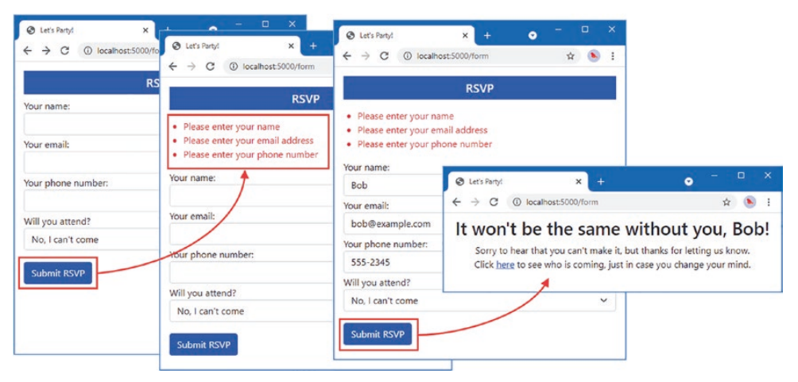

<h1 align="center">
  
  🎉 Party Invites
  
</h1>

<p align="center">
  <a href="https://github.com/NikolaM-Dev/party-invites/stargazers">
    
  </a>
  <a href="https://github.com/NikolaM-Dev/party-invites/issues">
    
  </a>
  <a href="https://github.com/NikolaM-Dev/party-invites/contributors">
    
  </a>
</p>

<p align="center">
  
</p>

## 🏭 Use Case

Imagine that a friend has decided to host a New Year's Eve party and that she
has asked me to create a web app that allows her invitees to electronically
RSVP. She has asked for these key features:

- A home page that shows information about the party.
- A form that can be used to RSVP, which will display a thank-you page.
- Validation to ensure the RSVP form is filled out.
- A summary page that shows who is coming to the party.

## 🧩 Requires

- [go](https://go.dev/dl/)

## 💨 Run

```sh
go run main.go
```

&nbsp;

<p align="center">
  
</p>
<p align="center">
  Copyright &copy; 2022-present
  <a href="https://github.com/glepnir" target="_blank">NikolaM-Dev</a>
</p>
<p align="center">
  <a href="https://github.com/NikolaM-Dev/party-invites/blob/master/LICENSE"
    ></a>
</p>
